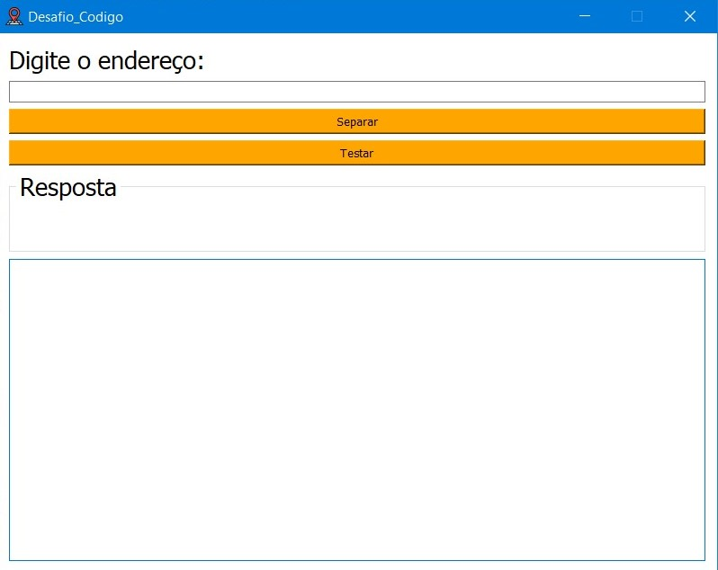

# PwC_Code

##Tecnologias usadas:
linguagem: Python
Testes: Unittest
Interface: PyQt5
Convertor para .exe: auto-py-to-exe

##Funções Principais

###address_redirector(request)
Esta função principal redireciona a string de requisição para funções específicas com base no tipo de endereço. Retorna uma string formatada com o nome e o número separados.

#####Parâmetros:
request (str): Uma string contendo informações de endereço.
#####Retorno:
str: Uma string formatada com o nome e o número separados, encapsulados por chaves.

##Funções Auxiliares
###bigger_address(info_list)
Extrai o nome e o número de um endereço mais complexo.

#####Parâmetros:
info_list (list): Uma lista de palavras representando as informações de endereço.
#####Retorno:
list: Uma lista contendo o nome e o número separados.

###foreigner_address(info_list)
Extrai o nome e o número de um endereço estrangeiro.

#####Parâmetros:
info_list (list): Uma lista de palavras representando as informações de endereço.
#####Retorno:
list: Uma lista contendo o nome e o número separados.

###is_foreigner_address(info_list)
Verifica se o endereço é estrangeiro com base em determinados critérios.

#####Parâmetros:
info_list (list): Uma lista de palavras representando as informações de endereço.
#####Retorno:
bool: True se o endereço for considerado estrangeiro, False caso contrário.

###has_number(word)
Verifica se uma palavra contém um dígito numérico.

#####Parâmetros:
word (str): Uma string representando uma palavra.
#####Retorno:
bool: True se a palavra contiver um dígito numérico, False caso contrário.

##Como rodar:

####Primeira forma:
Baixe o exe e clique no AddressSplitter.exe

####Segunda forma:
Baixe os arquivos, escolha uma IDE para rodar, baixe Python, baixe a biblioteca PyQt5 com "pip install PyQt5" e rode o AddressSplitter.py

##Resultado

